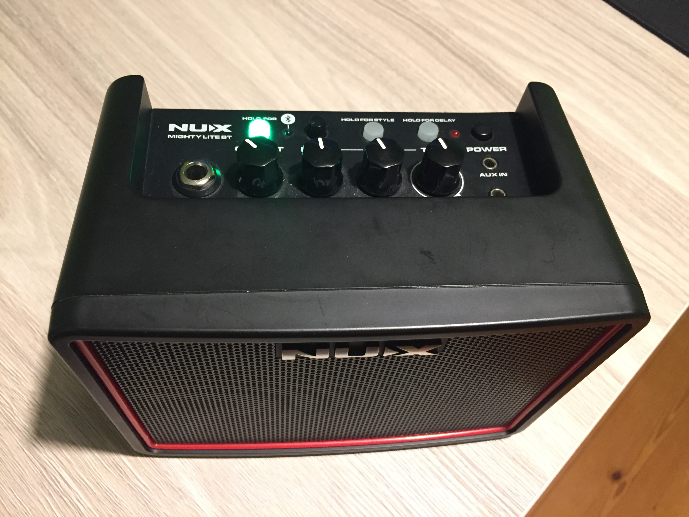
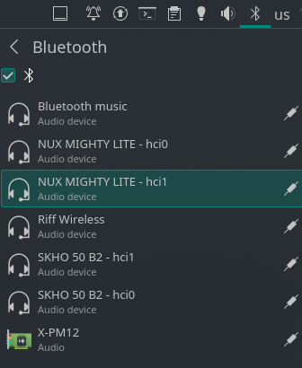

# NUX Mighty Lite BT - Linux
Howto use midi commands in Linux with NUX amplifier.

truly indispensable knowledge :)




## 1. Bluetooth
Simple part.

First, you must ensure that your bluetooth is working correctly.
Some old adapters does't work with BTLE.

> Pair NUX as regular sound device (not MIDI)




# 2. Receive MIDI commands
> Tricky part, I need more info/help here.

> Before notify you must write to device

> Check correct adapter in attribute path ! `hci1, hci0`

Run `bluetoothctl`
```
select 00:1A:7D:DA:71:0F    <---  your correct adapter here

scan on
trust CB:4E:FD:CD:AE:1F
connect CB:4E:FD:CD:AE:1F
pair CB:4E:FD:CD:AE:1F
menu gatt
list-attributes
select-attribute /org/bluez/hci0/dev_CB_4E_FD_CD_AE_1F/service000a/char000b
read128:0   Control change          0, controller 85, value 91
128:0   Control change          0, controller 85, value 83

```

Check it
```
❯ aseqdump -p 128:0
Waiting for data. Press Ctrl+C to end.
Source  Event                  Ch  Data
128:0   Control change          0, controller 61, value 0
128:0   Control change          0, controller 85, value 99
128:0   Control change          0, controller 85, value 76
```

# 3. MIDI commands
## Knobs

Control  | Channel | Example value
-------- | ------- | -------------
GAIN     | 13      | value 0-127
VOLUME   | 15      | value 0-125
TONE     | 14      | value 0-127
DLY/RVB  | 85      | value 0-120, 0-115 

## Buttons
Control  | Channel | Example value
-------- | ------- | -------------
OD/DIST  | 13      | 1-**OD**, 2-**METAL**, 0-**CLEAN**
DRUM     | 122     | 127-**ON** 0-**OFF**
DRUM-CHG | 123     | 0..9
TAP      | 30      | 0..127
